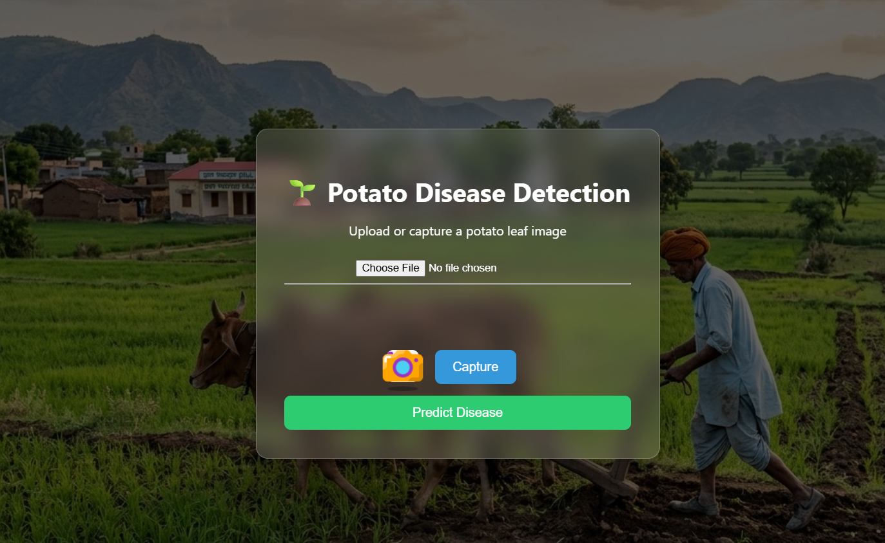
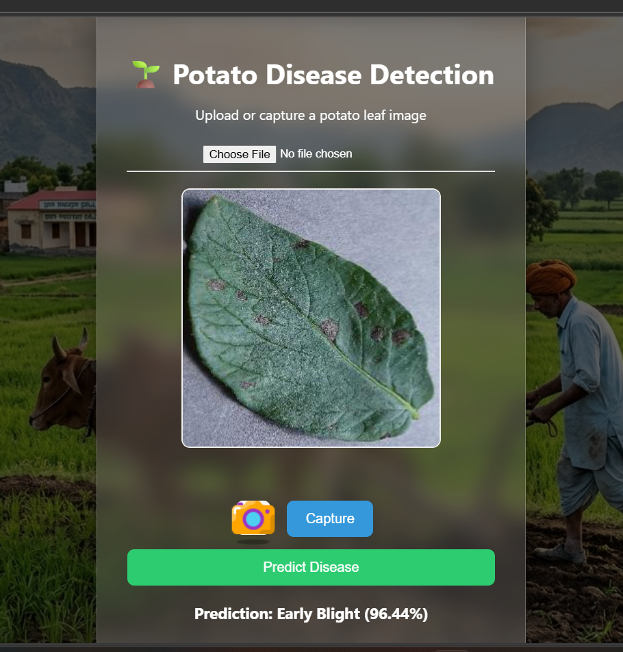

# 🌱 Potato Leaf Disease Detection

An AI-based web application that detects potato leaf diseases using Deep Learning.
Upload an image of a potato leaf and get instant predictions with confidence score.

---

## 🚀 Features

* 📷 Upload potato leaf images
* 🤖 Deep Learning model for disease prediction
* 📊 Shows predicted class and confidence
* 🌐 Simple and clean web interface
* ⚡ Flask backend for real-time predictions

---

## 🧠 Model Details

* Framework: TensorFlow / Keras
* Model Type: CNN (Convolutional Neural Network)
* Classes:

  * Early Blight
  * Late Blight
  * Healthy

---

## 🛠️ Tech Stack

* Python 3.10
* TensorFlow
* Flask
* HTML, CSS (Frontend)
* NumPy, Pillow

---

## 📁 Project Structure

```
Potato-Disease-Detection/
│
├── static/              # CSS / js / images
├── templates/           # HTML files
├── model/               # Saved model
├── app.py               # Flask app
├── predict.py
├── screenshorts/
├── requirements.txt
└── README.md
```

---

## ⚙️ Installation

### 1️⃣ Clone the repository

```bash
git clone https://github.com/your-username/potato-disease-detection.git
cd potato-disease-detection
```

---

### 2️⃣ Create virtual environment

```bash
python -m venv myenv
```

Activate it:

**Windows**

```bash
myenv\Scripts\activate
```

**Mac/Linux**

```bash
source myenv/bin/activate
```

---

### 3️⃣ Install dependencies

```bash
pip install -r requirements.txt
```

---

## ▶️ Run the Project

```bash
python app.py
```

Open in browser:

```
http://127.0.0.1:5000
```

---

## 📸 How It Works

1. Upload a potato leaf image
2. Image is processed using the trained model
3. Model predicts disease class
4. Result with confidence is displayed

---

## 📸 Screenshots

<p align ="center">
  <h2> Home Page <h2>
  
  <br/>
  <h2> Result <h2>
  
</p>

## 📌 Future Improvements

* Add Android app 
* Improve model accuracy
* Add more crop disease detection
* Deploy on cloud (Render / Railway / AWS)

---
## ⭐ Support

If you like this project, give it a ⭐ on GitHub!
